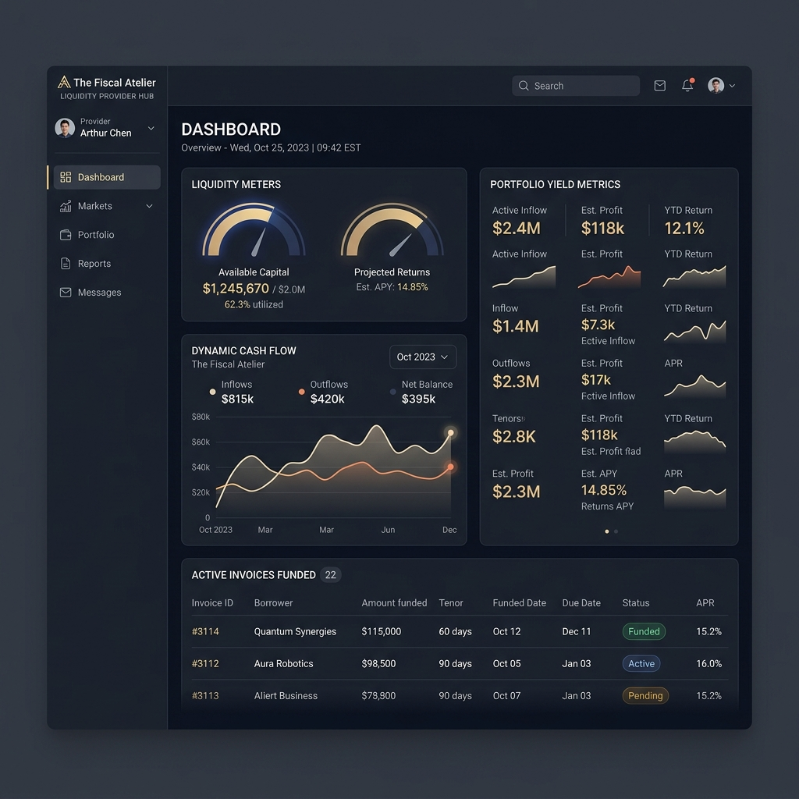
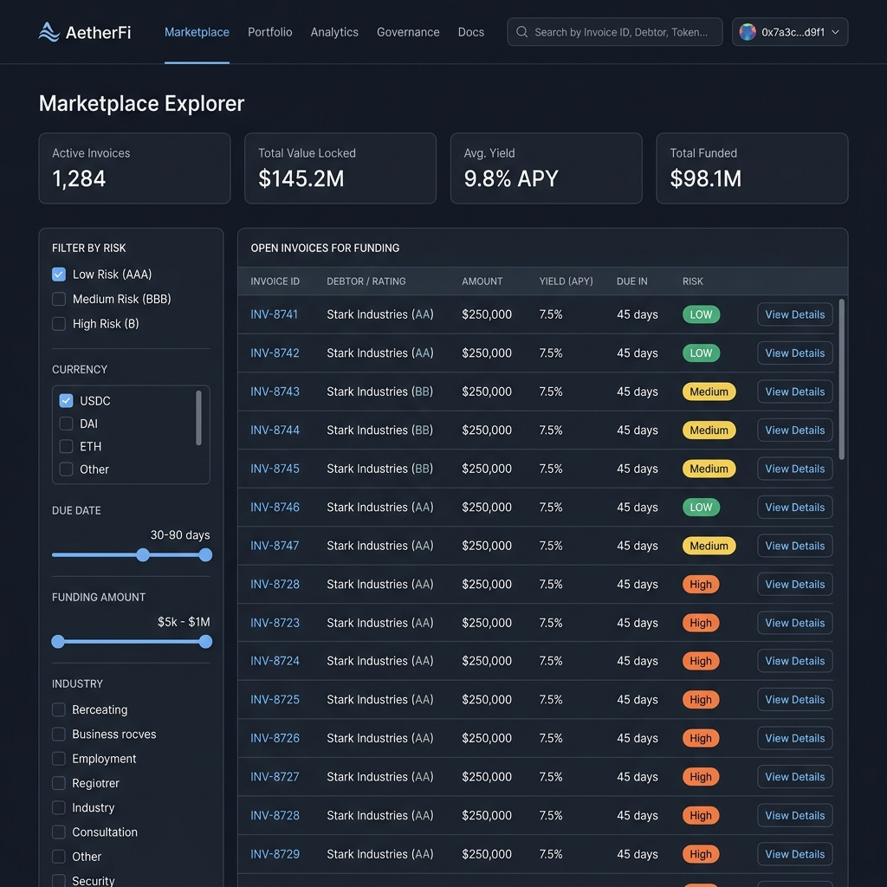

# Invoice Liquidity Network (ILN) Frontend

An open-source invoice factoring protocol built on the Stellar network. ILN bridges the gap between freelancers seeking immediate payment and liquidity providers looking for short-term yields.

---

## 🎨 Creative North Star: "The Fiscal Atelier"

The user interface follows a curated design system strategy known as **The Fiscal Atelier**. Rather than standard sterile, template-locked fintech designs, ILN provides a bespoke workspace where precision meets editorial warmth.

- **Color & Tonal Architecture**: Rooted in a "Warm Industrial" aesthetic combining structural Navy/Slate with warm parchment grays.
- **The "No-Line" Rule**: The layout explicitly avoids 1px borders for containment, using background shifts (`surface`, `surface-container-low`, `surface-container-high`) to create architectural boundaries.
- **Typography Dialogue**: Pairs the editorial authority of the *Newsreader* serif typeface for display statements and data points with the functional clarity of the *Manrope* sans-serif.

For a deep dive into layout grids, elevation layers, and color tokens, read the full [DESIGN.md](DESIGN.md) document.

---

## 🛠 Tech Stack

- **Framework**: [Next.js 16 (App Router)](https://nextjs.org/) & React 19
- **Language**: TypeScript
- **Styling**: Tailwind CSS v4 & PostCSS (Warm Industrial theme, Custom typography pairings)
- **Blockchain Integration**:
  - [@stellar/stellar-sdk](https://www.npmjs.com/package/@stellar/stellar-sdk) for smart contract interaction (Soroban)
  - [@stellar/freighter-api](https://www.npmjs.com/package/@stellar/freighter-api) for connection with Freighter wallet
- **Data Fetching & Cache**: [@tanstack/react-query](https://tanstack.com/query/latest) (React Query)
- **Email Reminders**: [Supabase JS Client](https://supabase.com/docs/reference/javascript/introduction) & [Resend API](https://resend.com/)
- **Visual Testing**: [Storybook](https://storybook.js.org/) & [Chromatic](https://www.chromatic.com/) for visual regression
- **Mocking**: [Mock Service Worker (MSW)](https://mswjs.io/) for API mocking at the request boundary
- **Testing**: Vitest for unit & snapshot coverage, Playwright for E2E testing
- **Internationalization**: `i18next` and `react-i18next` for locales/translations

---

## 🏗 Application Architecture

For a deep dive into data flows, component interactions, and key trade-offs, refer to the [Frontend Architecture Overview](docs/architecture.md).

The application is structured logically to support multiple participant roles (freelancers, payers, liquidity providers, and governance administrators).

### 📁 Directory Layout

```
├── app/                      # Next.js App Router root
│   ├── admin/                # Admin portal (parameters, contract governance)
│   ├── analytics/            # Cash flow & volume charts
│   ├── api/                  # API endpoints (reminders, feedback)
│   ├── freelancer/           # Freelancer dashboard & invoice submission
│   ├── governance/           # Voting portal
│   ├── lp/                   # Liquidity Provider portfolio dashboard
│   ├── marketplace/          # Open invoices explorer
│   ├── payer/                # Payer dashboard & email reminders opt-in
│   ├── profile/              # User settings & reputation profiles
│   ├── submit/               # Submitter checkout & confirmation flows
│   └── Providers.tsx         # TanStack Query & MSW Provider setup
├── src/
│   ├── components/           # Reusable UI components (Bells, Drawers, Badges)
│   ├── context/              # Global React Contexts (Wallet, Notifications, Toasts)
│   ├── hooks/                # Custom React Hooks & background polling
│   ├── lib/                  # Services layer (Stellar SDK, Supabase client, Horizon)
│   └── utils/                # General helpers (reputation decay, health checks)
```

### 🧩 Core Component Layers

1. **Smart Contract Layer (`src/lib/invoice-nft.ts` & `src/lib/contract/`)**
   - Connects frontend actions to the Soroban smart contract.
   - Reconstructs Invoice NFT metadata and tracks mint/burn/transfer event history by scanning the Horizon transaction logs and simulating Soroban contract invocations.

2. **State & Context Layer (`src/context/`)**
   - **`WalletContext`**: Monitors Freighter wallet connection, active address, and queries multi-token balances (USDC, EURC, XLM) on Stellar.
   - **`NotificationContext`**: Handles in-app notification center persistence via `localStorage` (caps at 20 logs).
   - **`ToastContext`**: Powers non-blocking alerts.

3. **Background Polling & Sync (`src/hooks/usePositionPolling.ts`)**
   - Monitors state transitions of funded invoices (e.g. `Funded -> Paid`, `Funded -> Defaulted`, or `Funded -> Disputed`) for the connected LP. It runs queries every 60 seconds and notifies the LP about due date expiration.

4. **Payer Email Reminders (`app/api/reminders/`)**
   - Allows payers to opt-in using their email. A background cron script checks for funded invoices due in 72 hours and 24 hours, queries preferences from a Supabase table, sends warning templates via Resend, and logs records to prevent duplicate deliveries.

---

## 🚀 Quick Start

### Prerequisites
- Node.js 18+ and npm

### 1. Install Dependencies
```bash
npm install
```

### 2. Configure Environment Variables
Copy `.env.example` to `.env.local` (see the [Environment Variables](#-environment-variables-reference) section below for details):
```bash
cp .env.example .env.local
```

### 3. Run Development Server
```bash
npm run dev
```
Open [http://localhost:3000](http://localhost:3000) with your browser.

### 4. Running Tests
- **Unit & Snapshot Tests (Vitest)**:
  ```bash
  npm test
  ```
  To update Vitest snapshot files after intentional UI changes, run:
  ```bash
  npm test -- --update-snapshots
  ```
- **End-to-End Tests (Playwright)**:
  ```bash
  npm run test:e2e
  ```

### 5. Storybook & Visual Regression
Storybook and Chromatic are used to check UI components for regressions.
- **Start Storybook locally**:
  ```bash
  npm run storybook
  ```
- **Run visual regression checks**:
  ```bash
  npm run chromatic
  ```

---

## 🔑 Environment Variables Reference

Here is a detailed guide of the configuration options available:

### 🌐 Stellar & Smart Contract Settings
| Variable | Default Value | Description |
| :--- | :--- | :--- |
| `NEXT_PUBLIC_CONTRACT_ID` | `CD3TE3IAHM737P236XZL2OYU275ZKD6MN7YH7PYYAXYIGEH55OPEWYJC` | The primary Invoice Factoring smart contract ID on Soroban. |
| `NEXT_PUBLIC_NETWORK_PASSPHRASE` | `Test SDF Network ; September 2015` | Stellar network identifier passphrase. |
| `NEXT_PUBLIC_RPC_URL` | `https://soroban-testnet.stellar.org` | Soroban RPC server endpoint. |
| `NEXT_PUBLIC_NETWORK_NAME` | `TESTNET` | Descriptive name of the active Stellar network. |
| `NEXT_PUBLIC_STELLAR_NETWORK` | `testnet` | Network type identifier (`testnet`, `public`). |
| `NEXT_PUBLIC_TESTNET_USDC_TOKEN_ID`| `CCW67TSZV3SSS2HXMBQ5JFGCKJNXKZM7UQUWUZPUTHXSTZLEO7SJMI75` | Asset contract ID for USDC on testnet. |
| `NEXT_PUBLIC_TESTNET_EURC_TOKEN_ID`| `GDHU6WRG4IEQXM5NZ4BMPKOXHW76MZM4Y2IEMFDVXBSDP6SJY4ITNPP` | Asset contract ID for EURC on testnet. |
| `NEXT_PUBLIC_TESTNET_XLM_TOKEN_ID` | `native-xlm` | Token identifier for Native XLM. |
| `NEXT_PUBLIC_GOVERNANCE_ADMIN_ADDRESS`| `GAAAAAAAAAAAAAAAAAAAAAAAAAAAAAAAAAAAAAAAAAAAAAAAAAAAAWHF` | Admin fallback address for parameters governance. |
| `NEXT_PUBLIC_INSURANCE_POOL_ENABLED`| `false` | Enables/disables the liquidity insurance pooling feature. |
| `NEXT_PUBLIC_NFT_ENABLED` | `false` | Set to `true` to enable Soroban Invoice NFT metadata displays. |
| `NEXT_PUBLIC_NFT_CONTRACT_ID` | Defaults to contract ID | Contract ID for Invoice NFTs (if separated from primary). |
| `NEXT_PUBLIC_NFT_METADATA_METHOD` | `token_uri` | Contract function that returns token metadata URI. |
| `NEXT_PUBLIC_NFT_EVENT_HINTS` | `""` | Hints helper (e.g., `mint:Minted;transfer:Transfer;burn:Burned`). |

### 🗄️ Notifications, Databases & Email (Backend/Cron)
| Variable | Description |
| :--- | :--- |
| `NEXT_PUBLIC_SUPABASE_URL` | The endpoint URL for the Supabase database. |
| `NEXT_PUBLIC_SUPABASE_ANON_KEY` | Anonymous browser-safe public key for Supabase. |
| `SUPABASE_SERVICE_ROLE_KEY` | Backend service key used by reminder crons to bypass RLS policies. |
| `RESEND_API_KEY` | API key from Resend.com used to dispatch payer reminder emails. |
| `CRON_SECRET` | Secret token to secure `/api/reminders` GET trigger from unauthorized calls. |
| `NOTIFICATION_API` | External backend base URL to fetch notifications. |
| `INDEXER_URL` | Base API URL of the ILN contract data indexer. |
| `NEXT_PUBLIC_INDEXER_API_URL` | Public indexer endpoint for activity feeds and analytics charts. |
| `NEXT_PUBLIC_APP_URL` | Base URL of the deployed application (defaults to `https://app.iln.finance`). |

### 🧪 Testing & Analytics
| Variable | Description |
| :--- | :--- |
| `NEXT_PUBLIC_API_MOCKING` | Set to `enabled` to run MSW mocks in local development. |
| `NEXT_PUBLIC_ORACLE_ENABLED` | Set to `true` to display Oracle verification badges. |
| `GITHUB_TOKEN` / `GITHUB_OWNER` / `GITHUB_REPO` | Secrets used by the feedback widget to raise GitHub issues directly. |

---

## 📸 Screenshots

### 📊 Liquidity Provider Dashboard
Provides LPs with real-time portfolio metrics, cash flow analysis, liquidity meters, and active funding statuses.


### ✍️ Freelancer Dashboard
Allows freelancers to manage invoice factoring parameters, submit new invoices, view reputation ratings, and review cash advance details.


### 🔍 Marketplace Explorer
A central marketplace listing all active open invoices waiting for funding, detailed interest rates, and risk rankings.


---

## 🔗 Useful Links & Documentation

- **Getting Started Guide**: Refer to the [Quick Start](#-quick-start) section.
- **Frontend Architecture Overview**: Learn about our architecture design and libraries in [docs/architecture.md](docs/architecture.md).
- **Contribution Guidelines**: Read [CONTRIBUTING.md](CONTRIBUTING.md) for comprehensive setup instructions, testing standards, code style guidelines, Stellar-specific setup, and development workflow.
- **Visual Regression Testing**: Learn about baseline configurations in [docs/VISUAL_REGRESSION_WORKFLOW.md](docs/VISUAL_REGRESSION_WORKFLOW.md).
- **Design System Blueprint**: Deep dive into "The Fiscal Atelier" aesthetic rules in [DESIGN.md](DESIGN.md).
- **Live Deployed App**: Access the application on [app.iln.finance](https://app.iln.finance).

---

## 🤝 Contributing

Contributions are welcome! Please read our [CONTRIBUTING.md](CONTRIBUTING.md) first.

1. Create a branch: `git checkout -b feature/your-feature-name`
2. Make your changes and write stories for new components.
3. Commit using conventional formats: `feat(scope): describe changes`
4. Run testing commands: `npm run lint` and `npm run test`
5. Open a Pull Request.
